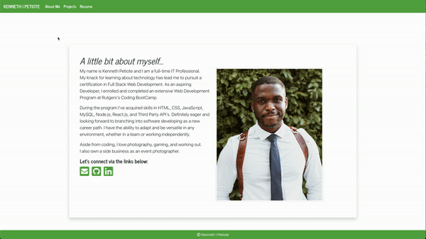

## React Google Book Search


## Table of Contents
* [Description](#description)
* [Demo](#demo)
* [Program Installation](#program-installation)
* [Program Usage](#program-usage)
* [Technologies](#technologies)
* [Links](#links)
* [Contribution](#contribution)
* [Questions](#questions)
* [License](#license)

## Description
The purpose of this application is to show my latest portfolio using react.\
Upon first loading the program, the end-user will be greeted with my home page.\
User should be able to browse and see an About Me, Projects and Resume.

## Demo


## Program Installation
To use this program we will need to install Node.js & React.\
Please use the link below to download a suitable version for your OS:

[Node.js Downloads](https://nodejs.org/en/download/)

Once installed we can use your command-line interface\
(Git/Terminal - MacOS, Linux & Ubuntu, CMD/Git - Windows)\
to run browse to the main repository, then run the following commands:

```bash
npm install
```

To install the necessary dependencies from the package.json for the program to run.

## Program Usage
After using the program installation instructions, we can then start using the program\
Remaining in the terminal, we can use the following command to run the application:

```bash
npm start
```

The program will then initialize and function as shown in the demo.

## Technologies
- [Bootstrap](https://getbootstrap.com/)
- [CSS](https://developer.mozilla.org/en-US/docs/Web/CSS)
- [HTML](https://developer.mozilla.org/en-US/docs/Web/HTML)
- [Javascript](https://www.javascript.com/)
- [Node.js](https://nodejs.org/en/about/)
- [React](https://reactjs.org/)

## Links
- [Github Repository URL](https://github.com/Kpetiote/React-Portfolio)
- [Heroku Live Site](https://kenpet-react-google-booksearch.herokuapp.com/)
## Contribution
None

## Questions
Please feel free to contact me with any questions:
- [Email](mailto:kenneth.petiote@gmail.com)
- [Github](https://github.com/Kpetiote)

## License

<br />
Licensed under the MIT License license.

Copyright (c) 2021 Kenneth Petiote

Permission is hereby granted, free of charge, to any person obtaining a copy
of this software and associated documentation files (the "Software"), to deal
in the Software without restriction, including without limitation the rights
to use, copy, modify, merge, publish, distribute, sublicense, and/or sell
copies of the Software, and to permit persons to whom the Software is
furnished to do so, subject to the following conditions:

The above copyright notice and this permission notice shall be included in all
copies or substantial portions of the Software.

THE SOFTWARE IS PROVIDED "AS IS", WITHOUT WARRANTY OF ANY KIND, EXPRESS OR
IMPLIED, INCLUDING BUT NOT LIMITED TO THE WARRANTIES OF MERCHANTABILITY,
FITNESS FOR A PARTICULAR PURPOSE AND NONINFRINGEMENT. IN NO EVENT SHALL THE
AUTHORS OR COPYRIGHT HOLDERS BE LIABLE FOR ANY CLAIM, DAMAGES OR OTHER
LIABILITY, WHETHER IN AN ACTION OF CONTRACT, TORT OR OTHERWISE, ARISING FROM,
OUT OF OR IN CONNECTION WITH THE SOFTWARE OR THE USE OR OTHER DEALINGS IN THE
SOFTWARE.